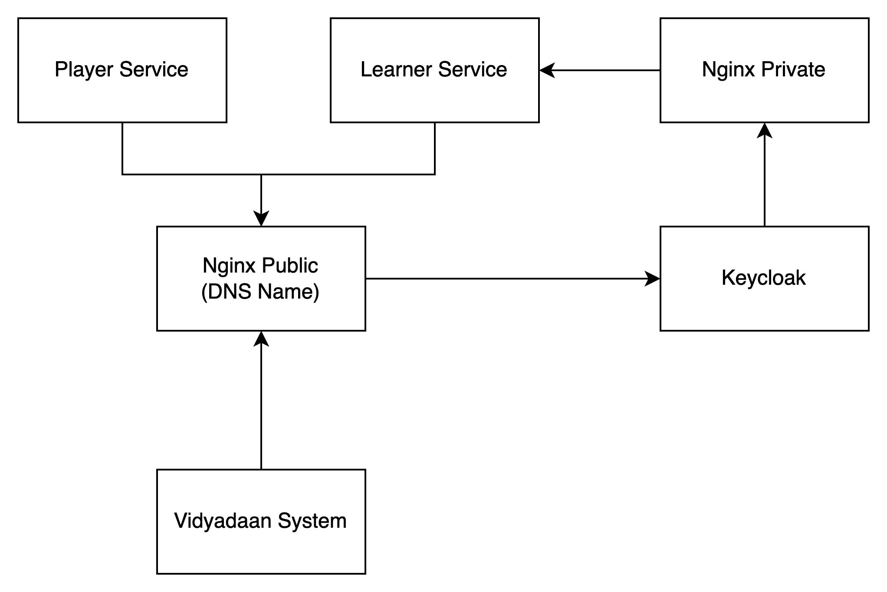
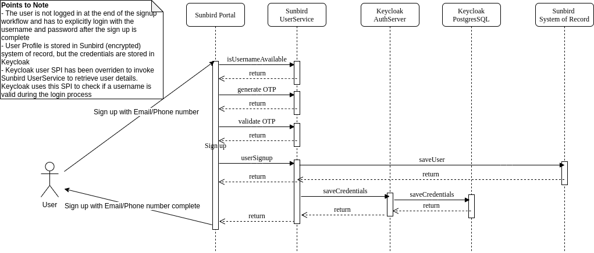

 **Introduction** 
* We are using the open source Keycloak 7.0.1 version. To know more about Keycloak and its features, read here - [https://www.keycloak.org/documentation](https://www.keycloak.org/documentation)

* Keycloak is used as an authentication system on Sunbird

* Sunbird has used SPI (service provider interface) to customise login, registration, forgot password  workflows and federated user provider

* Sunbird has also customised the look and feel by adding Keycloak themes and email templates

### High level architecture depicting the components connected to Keycloak 

* Only a handful of services connect to Keycloak

* Only nginx public has been allowed and configured to connect to keycloak is the traffic originates from outside VPC

* Portal, learner service and Vidydaan system connect to Keycloak via nginx public using the domain name

* Keycloak connects to learner service via nginx private ingress

### Provision, bootstrap , build, configuration and deploy instructions 

* Refer the the ED microsite and private repo template files for the Keycloak related jobs, variables and configurations

* Provision - [https://github.com/project-sunbird/sunbird-devops/tree/master/ansible/roles/keycloak-provision](https://github.com/project-sunbird/sunbird-devops/tree/master/ansible/roles/keycloak-provision)

* Deploy and Bootstrap - [https://github.com/project-sunbird/sunbird-devops/tree/master/ansible/roles/keycloak-deploy](https://github.com/project-sunbird/sunbird-devops/tree/master/ansible/roles/keycloak-deploy)

* These are the list of jobs related to Keycloak. What each of this job does is already docuements in the ED microsite next to the job names.

    * Build/Core/Keycloak

    * ArtificatUpload/Core/Keycloak

    * Provision/Core/Keycloak

    * Deploy/Kubernetes/KeycloakRealm

    * Deploy/Kubernetes/Keycloak

    
* Take a look at the relevant jenkins jobs and ansible roles to understand what each job / roles does

* Configuration file which has configuration on connection to DB and clustering - [https://github.com/project-sunbird/sunbird-devops/blob/master/ansible/roles/keycloak-deploy/templates/standalone-ha.xml](https://github.com/project-sunbird/sunbird-devops/blob/master/ansible/roles/keycloak-deploy/templates/standalone-ha.xml)

### Custom changes done by Sunbird

* SPI changes - [https://github.com/Sunbird-Lern/sunbird-auth](https://github.com/Sunbird-Lern/sunbird-auth)

* Themes and email templates - [https://github.com/project-sunbird/sunbird-devops/tree/master/ansible/artifacts/sunbird](https://github.com/project-sunbird/sunbird-devops/tree/master/ansible/artifacts/sunbird)

* Cassandra federation - [https://github.com/Sunbird-Lern/sunbird-auth/tree/release-3.8.0](https://github.com/Sunbird-Lern/sunbird-auth/tree/release-3.8.0)

### Realm Settings and configurations

* Keycloak realm configurations docs -[https://www.keycloak.org/docs/latest/server_admin/#configuring-realms](https://www.keycloak.org/docs/latest/server_admin/#configuring-realms)

* Sunbird realm - [https://github.com/project-sunbird/sunbird-devops/blob/master/ansible/roles/keycloak-deploy/templates/keycloak-realm.j2](https://github.com/project-sunbird/sunbird-devops/blob/master/ansible/roles/keycloak-deploy/templates/keycloak-realm.j2)

* Onboard the sunbird realm onto keycloak using the  **Deploy/Kubernetes/KeycloakRealm** jenkins job

* Visit the keycloak admin console and take a look at the realm configurations which come as default, clients etc.

* Feel free to change any of the realm parameters as per your policy, for example the validity of an access token can be 1 hour or 30 days or something else depending on your need

### Federation setup with Cassandra

* This comes already pre installed as per the the realm setup when you run  **Deploy/Kubernetes/KeycloakRealm** jenkins job

* The federation provider is used to connect to learner service and fetch the user data from cassandra

* For more details on federation and code, reach out to [https://github.com/Sunbird-Lern](https://github.com/Sunbird-Lern) community

### Login, Signup, Forgot password flows 

* These are standard workflows similar to any website

* You can use phone number / email to signup or login or reset password

* All these flows use the SPI code and connect to learner service

* Signup flow connects to learner service and creates the user in cassandra and sets the password on keycloak database

* Login flow connects to learner service and fetches the user data from cassandra and validates the password from keycloak database

* For password flow connects to learner service and fetches the user data from cassandra and resets the password on keycloak database

* For more details on these flows and intricate details of API and code functionality, reach out to [https://github.com/Sunbird-Lern](https://github.com/Sunbird-Lern) community

### User sessions

* User sessions are stored in keycloak hep memory

* The sessions can be viewed on the keycloak admin page under users page or on the client page

* Sessions get auto expired on logout or on validity end time 

* The access token validity configuration for the realm decides the validity end time

### Operations and Maintenance 
Scaling up
* Create the VM

* Add the IP in the inventory groups \[keycloak-{1-9}] and keycloak  - [https://github.com/project-sunbird/sunbird-devops/blob/master/private_repo/ansible/inventory/dev/Core/hosts#L6-L10](https://github.com/project-sunbird/sunbird-devops/blob/master/private_repo/ansible/inventory/dev/Core/hosts#L6-L10)

* Run the  **Deploy/Kubernetes/Keycloak**  jenkins job

* Add the new VM to the load balancer backend pool

Scaling down
* Remove the VM to the load balancer backend pool

* Stop the keycloak process on the the node manually

* Remove the IP from the inventory groups \[keycloak-{1-9}] and keycloak  - [https://github.com/project-sunbird/sunbird-devops/blob/master/private_repo/ansible/inventory/dev/Core/hosts#L6-L10](https://github.com/project-sunbird/sunbird-devops/blob/master/private_repo/ansible/inventory/dev/Core/hosts#L6-L10)

* Run the  **Deploy/Kubernetes/Keycloak**  jenkins job

* Delete the VM

Upgrade
* Upgrade the keycloak package to use newer version in the build step - [https://github.com/Sunbird-Lern/sunbird-auth/blob/release-3.8.0/keycloak/scripts/pipelines/sunbird-auth-build/Jenkinsfile#L21](https://github.com/Sunbird-Lern/sunbird-auth/blob/release-3.8.0/keycloak/scripts/pipelines/sunbird-auth-build/Jenkinsfile#L21)

* Upgrade the keyclaok libraries on the dependent services

    * Portal service

    * Learner service

    
* Update the themes, email templates, realm, db connection and clustering configuration files as per new version format

* Deploy keycloak and test all workflows

* For more information on upgrades, refer to these links to get an idea on the complexity and issues that can occur during an upgrade

    * [[KeyCloak 6.0.1 upgrade|KeyCloak-6.0.1-upgrade]]

    * [[Keycloak Upgrade from 3.2.0-Final to 6.0.1|Keycloak-Upgrade-from-3.2.0-Final-to-6.0.1]]

    * [[Keycloak Upgrade from 3.2.0 to 7.0.1|Keycloak-Upgrade-from-3.2.0-to-7.0.1]]

    
* For more details on the upgrade process and dependencies, reach out to [https://github.com/Sunbird-Lern](https://github.com/Sunbird-Lern) community and [https://github.com/Sunbird-Ed/](https://github.com/Sunbird-Ed/) community

Known issues
* There are no known issues with respect to Keycloak after the package was upgraded to 7.0.1

# Sunbird Auth Architecture
 **Current Authentication Architecture** Attached are some diagrams that depict the current authentication architecture

 **Email/Phone number based sign up and sign in** .png)

 **Google based sign in** .png)

 **State sso sign in** .png)

 **Mobile refresh token workflow** 
1. The portal does not use the refresh tokens to get new access tokens.

1. The mobile app saves the refresh token and uses it to get a new access token once the existing access token expires

1. The app leverages the same portal flows above, but has a URL parameter indicating that is mobile. The workflows above (implemented on portal) route to a mobile specific url at the end of the process. The mobile app listens on these specific URLs and gets access to the refresh and access token as mentioned below.

    - In email/phone sign in, the app gets redirected to /oauth2callback?code={code}. It invokes a keycloak endpoint (/auth/realms/sunbird/protocol/openid-connect/token) to exchange the code to get the tokens

    - In the state SSO sign in, the app gets redirected to /sso/sign-in/success?id={id}. It invokes a portal endpoint (/v1/sso/create/session?id={extracted\[‘id’]}) to exchange the ID to get the tokens

    - In the google sign in workflow, the app gets the tokens directly as query params

 **      ** 

.png)

*****

[[category.storage-team]] 
[[category.confluence]] 
