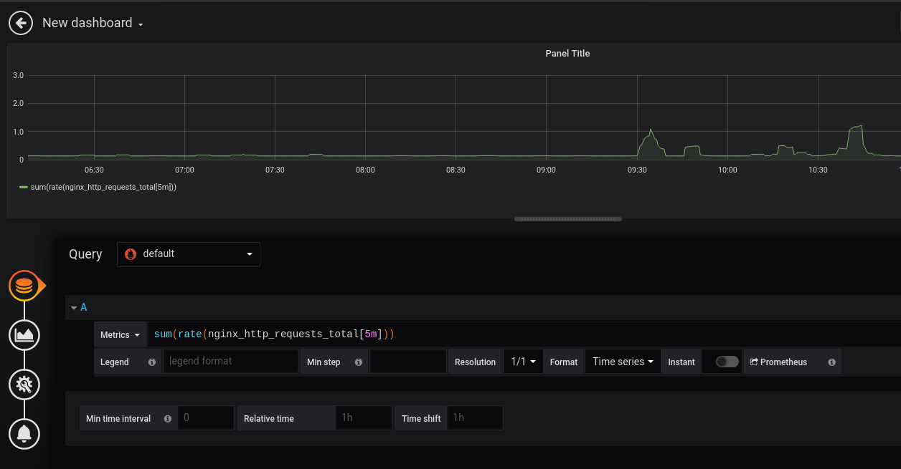
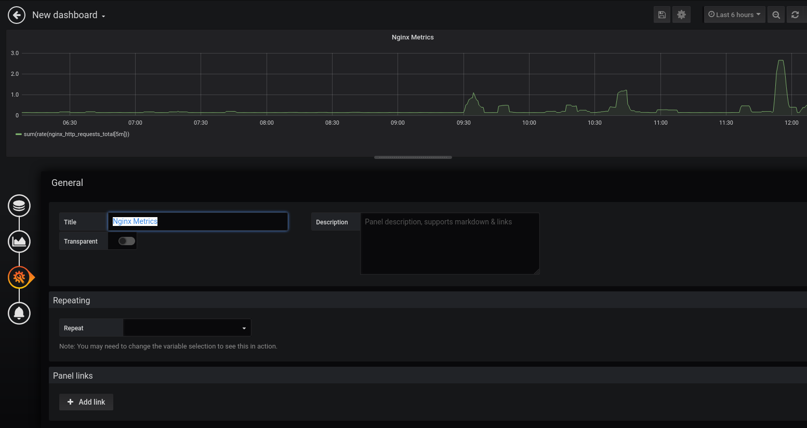
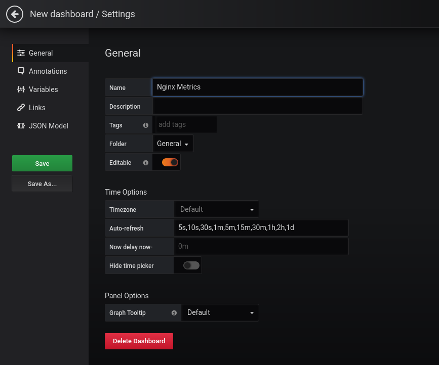
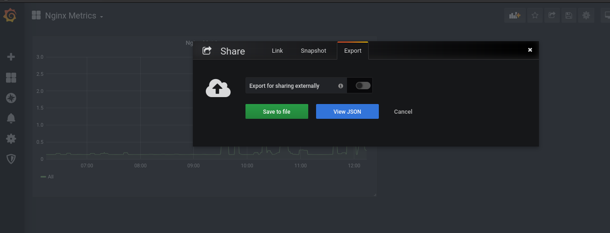
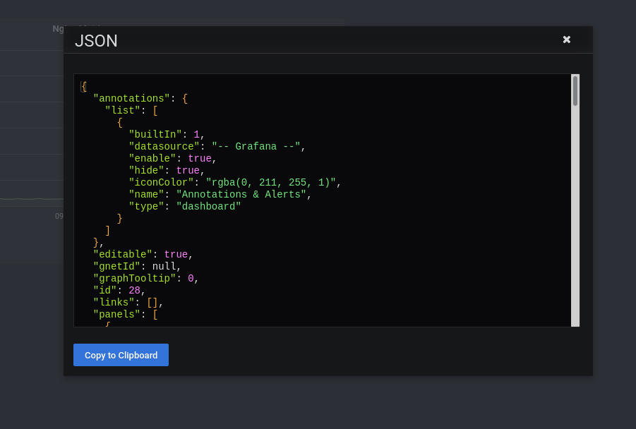
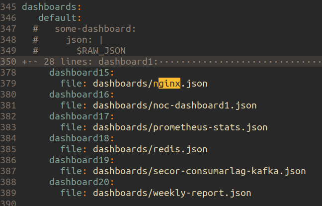

1. Open grafana url and enter username and password

1. Create a dashboard

    

 **after that select** Add Query **and write query** 

    

 **Change Appropriate title and save(on the top right corner)** 

 **Click on the Settings button(on the right-hand top button) and Give Proper name and save** 

1. After that you’ve to commit the dashboard to github in sunbird-devops, Click on the share icon on the right hand side

    

Click on export, and View json

    

    And copy to clipboard

    

1. Clone sunbird-devops [repo](https://github.com/project-sunbird/sunbird-devops)

1. Add the copied json to sunbird-devops/kubernetes/helm_charts/monitoring/dashboards/dashboards/<dashsboard-name>.json

1. Add the dashboard file path in values.yaml under dashboards.default dictionary.

    Here the dashboard name is nginx.json

    

1. Commit the changes and Create a PR against github.com/project-sunbird/sunbird-devops

1. Once your PR is merged, Go to Jenkins and run the Deploy/Kubernetes/Monitoring → type dashboards as tag and deploy

*****

[[category.storage-team]] 
[[category.confluence]] 
