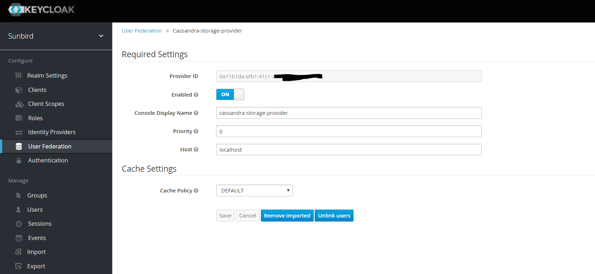

As part of relase-2.0.0, we are encrypting data in cassandra DB and removing users from Keycloak DB. Below are the steps that need to be performed for Sunbird to work.

 **Jira Link :  ** [https://project-sunbird.atlassian.net/browse/SC-911](https://project-sunbird.atlassian.net/browse/SC-911)

 **Design Doc : ** [Encrypting data stored within keycloak](https://project-sunbird.atlassian.net/wiki/spaces/SBDES/pages/1014988860/Encrypting+data+stored+within+keycloak)

 **Note:  Take back up of keycloak database** 

 **Switch to postgres user and run ** 


```
pg_dump keyclaok > keycloak_backup.db
```


 **Configuration Steps :** 


* Login to admin console and click User Federation tab on left panel of the screen. As shown in fig.


* Select cassandra-storage-provider from Add provider drop down on the screen , then you will be redirected to screen as shown 


* Click save button , It will generate one provider id as shown                                                                                                             

 


* Copy the provider id and update the private repo inventory under Core/secrets.yml for the variable  **core_vault_sunbird_keycloak_user_federation_provider_id** 
* Run below SQL queries on Keycloak database after replacing values for placeholders {PROVIDER_ID} and {realm name} in below query templates. Value of placeholders {PROVIDER_ID} and {realm name} is based on environment variables  **_core_sunbird_keycloak_user_federation_provider_id_**  and  **_keycloak_realm_**  respectively.


These below are Postgres queries. So you need to login to postgres and run these queries on keycloak db. Below is the code to switch to keycloak DB


| psql (9.5.17, server 9.5.16) Type "help" for help.postgres=>  **\l** postgres=>  **\c keycloak**  You are now connected to database "keycloak"  | 

 **Query Templates**                 


| insert into FEDERATED_USER(ID, STORAGE_PROVIDER_ID, REALM_ID)select concat('f:{PROVIDER_ID}:', USER_ENTITY.ID), '{PROVIDER_ID}', '{realm name}' from public.USER_ENTITY; insert into FED_USER_CREDENTIAL(ID, DEVICE, HASH_ITERATIONS, SALT, TYPE, VALUE, CREATED_DATE, COUNTER, DIGITS, PERIOD, ALGORITHM, USER_ID,                  REALM_ID,STORAGE_PROVIDER_ID) select ID, DEVICE, HASH_ITERATIONS, SALT, TYPE, VALUE, CREATED_DATE, COUNTER, DIGITS, PERIOD, ALGORITHM, concat('f:{PROVIDER_ID}:',USER_ID), '{realm name}', '{PROVIDER_ID}' from CREDENTIAL; insert into FED_USER_REQUIRED_ACTION(REQUIRED_ACTION, USER_ID, REALM_ID, STORAGE_PROVIDER_ID)select REQUIRED_ACTION, concat('f:{PROVIDER_ID}:', USER_ID), '{realm name}', '{PROVIDER_ID}' from USER_REQUIRED_ACTION; | 


 **Example:** 

{PROVIDER_ID} = 5a8a3f2b-3409-42e0-9001-f913bc0fde31

{realm name} = sunbird


| {PROVIDER_ID} = 5a8a3f2b-3409-42e0-9001-f913bc0fde31{realm name} = sunbird


| insert into FEDERATED_USER(ID, STORAGE_PROVIDER_ID, REALM_ID) select concat('f:5a8a3f2b-3409-42e0-9001-f913bc0fde31:', USER_ENTITY.ID),'5a8a3f2b-3409-42e0-9001-f913bc0fde31','sunbird'frompublic.USER_ENTITY; insert into FED_USER_CREDENTIAL(ID, DEVICE, HASH_ITERATIONS, SALT, TYPE, VALUE, CREATED_DATE, COUNTER, DIGITS, PERIOD, ALGORITHM, USER_ID, REALM_ID,STORAGE_PROVIDER_ID) select ID, DEVICE, HASH_ITERATIONS, SALT, TYPE, VALUE, CREATED_DATE, COUNTER, DIGITS, PERIOD, ALGORITHM, concat('f:5a8a3f2b-3409-42e0-9001-f913bc0fde31:',USER_ID),'sunbird','5a8a3f2b-3409-42e0-9001-f913bc0fde31'from CREDENTIAL; insert into FED_USER_REQUIRED_ACTION(REQUIRED_ACTION, USER_ID, REALM_ID, STORAGE_PROVIDER_ID) select REQUIRED_ACTION, concat('f:5a8a3f2b-3409-42e0-9001-f913bc0fde31:', USER_ID),'sunbird','5a8a3f2b-3409-42e0-9001-f913bc0fde31'from USER_REQUIRED_ACTION; | 


 | 


This completes the Keycloak configurations. Next we will be running migration scripts for Cassandra and Keycloak


*****

[[category.storage-team]] 
[[category.confluence]] 
